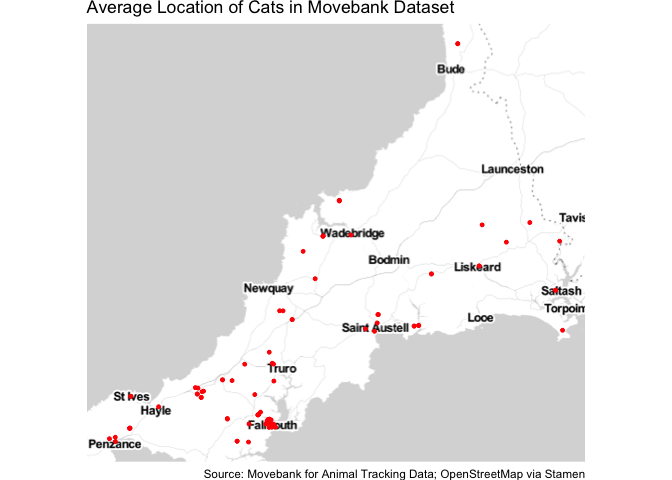
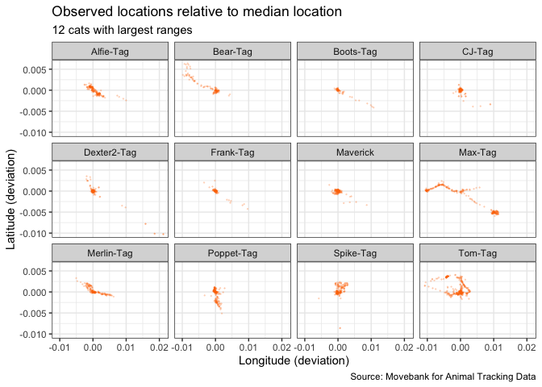
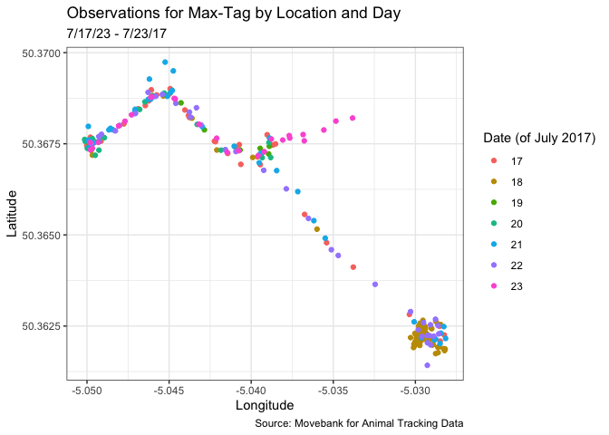

Tidy Tuesday - Movebank
================
Jerome Williams
2023-01-31

This week’s data is from the [Movebank for Animal Tracking
Data](https://www.datarepository.movebank.org/handle/10255/move.882).
This data was collected in connection with [Kays et
al. (2020)](https://doi.org/10.1111/acv.12563).

## Overview

My understanding is that the data contains records from June-August 2017
of observations of tags that were attached to a number of pet cats in
the United Kingdom. Each record contains the coordinates and timetamp of
a location “event”. As yet, I don’t know what triggers an “event” but
for now we will take the events as given.

First let’s make a simple map of the cat location events. The plot below
shows each tagged cat’s median location in the dataset, after removing
observations that have been classified as outliers. The basemap used
here is from [Stamen](https://stamen.com/).

<!-- -->

So it seems that the “UK” data is restricted to a set of cats in
Cornwall. At least that will make plotting easier. The dataset contains
data on 101 cats.

## Cat Ranges

Next, let’s look at how cats move around their homes.

The plot below plots (for all cats in the dataset) the position of each
observation relative its cat’s median location. Most observations are
clustered around their respective medians, as expected. However, there
are also some interesting features – it looks like at least one or two
cats have multiple home bases (or have moved house during the relevant
period). There is also the interesting straight line on the left side of
the plot – I am interested in seeing if we can explain that. I suspect
the observations in the bottom right corner may turn out to be data
errors.

Note: for simplicity, I keep the location data in units of longitude and
latitude, even though we are now examining distance converting to units
of distance would be more appropriate.

<!-- -->

Let’s try to find some of the cats with the interesting movement
patterns. Below, I filter to cats with the largest ranges (for
convenience, arbitrarily defined as longitude range plus latitude range)
and plot each separately.

    ## Warning in left_join(., cats_df, by = "tag_id"): Each row in `x` is expected to match at most 1 row in `y`.
    ## i Row 1 of `x` matches multiple rows.
    ## i If multiple matches are expected, set `multiple = "all"` to silence this
    ##   warning.

<!-- -->

## Max-Tag

Some of the ranges we observe above (e.g., Bear, Boots, Max, Tom) look
like they might lie along roads or rivers. Let’s see if we can use
street maps to figure determine whether this is the case. First let’s
look at Max.

Before we look at street maps, I want to check whether Max shuffles
between different locations during the period or whether Max simply
starts in one area and later shows up in another area. We will plot
Max’s locations with an indicator for time. Before we do that, let’s
check the time distribution of our Max observations.

<!-- -->

So we are dealing with a single week’s worth of data. It’s unclear to me
why Wednesday and Thursday would have fewer observations, but, as
mentioned above, I don’t yet know what triggers an event. One hypothesis
to bear in mind is that it may have been raining on Wednesday and
Thursday.

<!-- -->

Max seems to have at least two homes. There are observations at
south-east location on the 17th and 18th but then again on the 22nd.
Let’s see if see what Max is traversing with a basemap from the Google
Maps Platform.

<!-- -->

As we guessed, Max travels along roads between two different locations,
the “Farmhouse B&B in the south-east part of the map and the built-up
area on the western part of the map.
